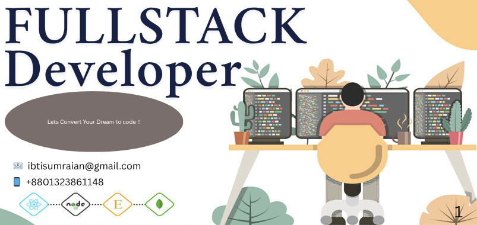

# 👋 Hi, I'm Ibtisum Raian  
### 💻 Web Developer | MERN Stack Enthusiast

---

## 🧑‍💼 About Me

I’m a passionate web developer with a strong interest in building full-stack applications using modern technologies like React, Node.js, and MongoDB.  
I enjoy solving problems, learning new frameworks, and creating clean and user-friendly interfaces.

---

## 🚀 Current Activities

- 🔍 Exploring **React.js**, **Tailwind CSS**, and **Framer Motion**
- 🛠️ Developing **WhereIsIt** – a full-stack lost & found item website with JWT authentication, MongoDB, and responsive UI
- 💡 Building a **Recipe Book App** with user auth, filtering, liking, and dark mode support
- 💳 Maintaining a **Bill Management System** for utility payments with profile and recovery features
- 📚 Revising core **JavaScript** concepts before diving deeper into advanced React

---

## 🌐 Socials:

---

## 💻 Tech Stack:

---

# 📊 GitHub Stats:

 

 

---

## 🏆 GitHub Trophies

---

### 🔝 Top Contributed Repo

---

<!-- Proudly created with GPRM ( https://gprm.itsvg.in ) -->
